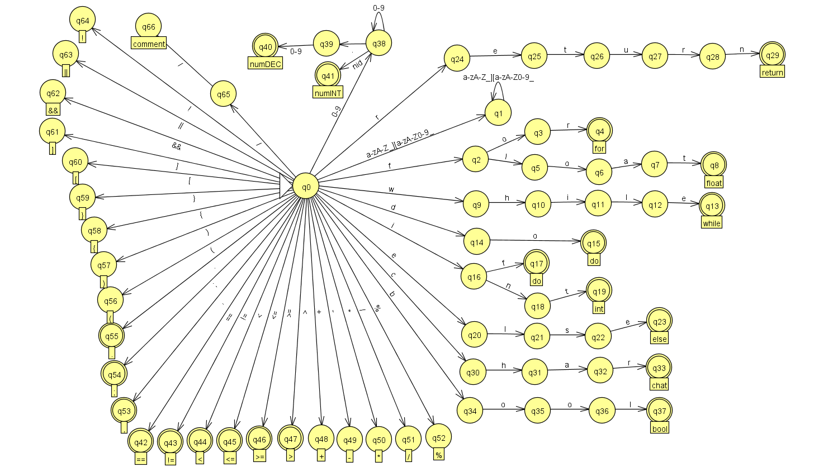

# Apresentação parte 1 projeto - Compiladores

## Tokens que devem ser considerados na análise léxica
* Definir e descrever os tokens que serão atendidos na Linguagem;


**Palavras reservadas**
```bash
int, float, char, if, else, while, for, return, true, false
```
**Tipos de dados**
```bash
int, float, char
```
**Operadores Aritiméticos**
| Operador | Token        | Descrição                 |
| -------- | ------------ | ------------------------- |
| `+`      | `ARITMETICO` | Soma                      |
| `-`      | `ARITMETICO` | Subtração                 |
| `*`      | `ARITMETICO` | Multiplicação             |
| `/`      | `ARITMETICO` | Divisão                   |
| `%`      | `ARITMETICO` | Módulo (resto da divisão) |

**Operadores Relacionais**
| Operador | Token        | Descrição        |
| -------- | ------------ | ---------------- |
| `==`     | `RELACIONAL` | Igual a          |
| `!=`     | `RELACIONAL` | Diferente de     |
| `<`      | `RELACIONAL` | Menor que        |
| `<=`     | `RELACIONAL` | Menor ou igual a |
| `>`      | `RELACIONAL` | Maior que        |
| `>=`     | `RELACIONAL` | Maior ou igual a |


**Operadores Lógicos**
| Operador | Token    | Descrição            |          |                |
| -------- | -------- | -------------------- | -------- | -------------- |
| `&&`     | `LOGICO` | E lógico (AND)       |          |                |
| \`       |          | \`                   | `LOGICO` | OU lógico (OR) |
| `!`      | `LOGICO` | Negação lógica (NOT) |          |                |

**Delimitadores e Pontuação**
| Símbolo | Token         | Descrição          |
| ------- | ------------- | ------------------ |
| `(`     | `DELIMITADOR` | Parêntese esquerdo |
| `)`     | `DELIMITADOR` | Parêntese direito  |
| `{`     | `DELIMITADOR` | Chave esquerda     |
| `}`     | `DELIMITADOR` | Chave direita      |
| `;`     | `DELIMITADOR` | Ponto e vírgula    |
| `,`     | `DELIMITADOR` | Vírgula            |

**Comentários**
| Tipo        | Token              | Exemplo            | Regex                 |
| ----------- | ------------------ | ------------------ | --------------------- |
| Linha única | `COMENTARIO_LINHA` | `// comentário`    | `/^\/\/.*/`           |
| Bloco       | `COMENTARIO_BLOCO` | `/* comentário */` | `/^\/\*[\s\S]*?\*\//` |

  
* Especificar os tokens da linguagem usando as expressões regulares; 
```node
module.exports = [
  { type: "STRING_LITERAL",       regex: /^"[^"\n]*"/ },
  { type: "COMENTARIO_LINHA",     regex: /^\/\/.*/ },
  { type: "COMENTARIO_BLOCO",     regex: /^\/\*[\s\S]*?\*\// },
  { type: "PALAVRA_RESERVADA",    regex: /^(?:return|for|while|do|if|else)\b/ },
  { type: "TIPO_VARIAVEL",        regex: /^(?:int|float|char|bool)\b/ },
  { type: "NUMERO_PONTO_FLUTUANTE", regex: /^[0-9]+\.[0-9]+/ },
  { type: "NUMERO_INTEIRO",       regex: /^[0-9]+/ },
  { type: "OPERADOR_RELACIONAL",  regex: /^(?:==|!=|<=|>=|<|>)/ },
  { type: "OPERADOR_LOGICO",      regex: /^(?:&&|\|\||!)/ },
  { type: "OPERADOR_ARITMETICO",  regex: /^[+\-*/%]/ },
  { type: "OPERADOR_ATRIBUICAO",  regex: /^=/ },
  { type: "CHAVE",                regex: /^[{}]/ },
  { type: "PARENTESE",            regex: /^[()]/ },
  { type: "PONTUACAO",            regex: /^[,;.:]/ },
  { type: "IDENTIFICADOR",        regex: /^[a-zA-Z_][a-zA-Z0-9_]*/ },
  { type: "QUEBRA_LINHA",         regex: /^\n/,       ignore: true },
  { type: "ESPACO_EM_BRANCO",     regex: /^[ \t\r]+/, ignore: true },
];

```
* Apresentar o reconhecimento dos tokens da linguagem por meio de AFD;



* Construir a tabela de transição.
Visualizar na planilha: https://docs.google.com/spreadsheets/d/1lkrvw9o-rDlzRAIaGbr0qKTpUZ5V__Qa17AuPT_wkXY/edit?gid=604490879#gid=604490879


----

### 1.2.2 Implementação do AL do mini compilador: 20% da A3

* Utilizar: Desvios condicionais; ou tabela de transição; ou Lex/Flex para gerar o
analisador léxico de forma automatizada

Foi utilizado estruturas condicionais (if, else, switch) para identificar e classificar os tokens.

_Trecho do código_
```node
function tokenize(code) {
  const resultado = [];
  let line = 1;

  // Normaliza quebras de linha (compatível com Linux, macOS, Windows)
  code = code.replace(/\r\n/g, "\n").replace(/\r/g, "\n");

  while (code.length > 0) {
    let matched = false;

    for (const token of tokens) {
      const match = token.regex.exec(code);
      if (match) {
        matched = true;
        const value = match[0];
        const novasLinhas = value.split("\n").length - 1;
        line += novasLinhas;

        if (!token.ignore) {
          resultado.push({
            type: token.type,
            value,
            line,
          });
        }

        code = code.slice(value.length);
        break;
      }
    }

    if (!matched) {
      resultado.push({
        type: "LEXICAL_ERROR",
        value: code[0],
        line,
      });
      code = code.slice(1);
    }
  }

  return resultado;
}
```
---

### 1.2.3 Execução do AL: 20% da A3

a) Deve ser desenvolvido uma solução que leia um código fonte de um arquivo ou em tempo de
execução e verifique se esse código (lexemas) pertence à linguagem

```node

//Trecho onde busco o código "remoto"
const code = fs.readFileSync("codigo.txt", "utf8");
const resultado = tokenize(code);

//em sequencia percorro pelo código para interpretalo de acordo com os tokens se faz parte da linguagem.
 while (code.length > 0) {
    let matched = false;

    for (const token of tokens) {
      const match = token.regex.exec(code);
      if (match) {
        matched = true;
```

b) Todos os lexemas analisados, quando pertencerem à Linguagem devem ser categorizados
conforme seu Token correspondente e apresentado visualmente em um lista.

**Entrada analisada**
```bash
int idade = 25;
```
**Resultado**
```bash
📦 Lista de Tokens e Lexemas:
Token: TIPO_VARIAVEL        | Lexema: "int"
Token: IDENTIFICADOR        | Lexema: "idade"
Token: OPERADOR_ATRIBUICAO  | Lexema: "="
Token: NUMERO_INTEIRO       | Lexema: "25"
Token: PONTUACAO            | Lexema: ";"
```

c) Os lexemas (identificadores, métodos, funções, classes) listados na tabela de símbolos devem ser
apresentados visualmente na tabela de símbolos.
**Entrada analisada**
```bash
int idade = 25;
```
**Resultado**
```bash
📦 Lista de Tokens e Lexemas:
Token: TIPO_VARIAVEL        | Lexema: "int"
Token: IDENTIFICADOR        | Lexema: "idade"
Token: OPERADOR_ATRIBUICAO  | Lexema: "="
Token: NUMERO_INTEIRO       | Lexema: "25"
Token: PONTUACAO            | Lexema: ";"

🔠 Tabela de Símbolos (Identificadores):
Lexema: "idade"
```
d) Quando o lexema não pertencer à linguagem, deve ser informado o erro e a linha, apresentandoos num relatório de erros
**Entrada**
```node
int idade = 25;
int = @err
```

**Resultado**
```bash
📦 Lista de Tokens e Lexemas:
Token: TIPO_VARIAVEL        | Lexema: "int"
Token: IDENTIFICADOR        | Lexema: "idade"
Token: OPERADOR_ATRIBUICAO  | Lexema: "="
Token: NUMERO_INTEIRO       | Lexema: "25"
Token: PONTUACAO            | Lexema: ";"
Token: TIPO_VARIAVEL        | Lexema: "int"
Token: OPERADOR_ATRIBUICAO  | Lexema: "="
Token: IDENTIFICADOR        | Lexema: "err"

🔠 Tabela de Símbolos (Identificadores):
Lexema: "idade"
Lexema: "err"

❌ Relatório de Erros Léxicos:
Lexema inválido: '@'
```
